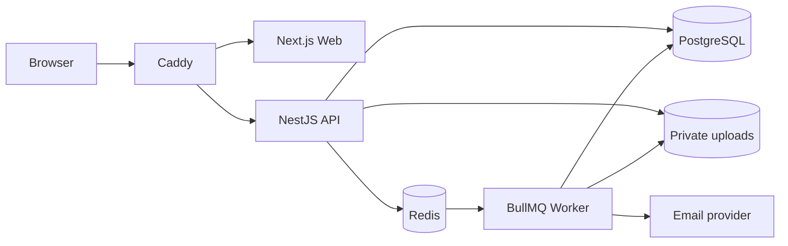
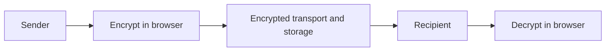
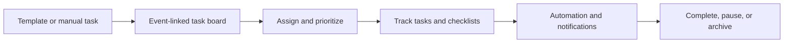

English | [Français](README.fr.md)

[](#overview)
[](LICENSE)


# PE Community

PE Community is a self-hosted workspace for operating a private community. It brings member administration, events, announcements, task boards, automation, notifications, audit logs, and encrypted participant chat into one bilingual application.


## Overview

The project provides separate owner, administrator, and member workspaces over a shared community platform. It is distributed as a source-built Docker Compose stack and includes a bilingual product and operator documentation site.

## Features

- Role-based owner, administrator, and member workspaces
- Member directory, profiles, registrations, announcements, and feed
- Events, calendar, RSVPs, task boards, and task automation
- Email delivery, templates, operational notifications, and audit logs
- Direct and group chat with browser-side encryption and encrypted attachments
- English and French interfaces and documentation
- Guided first-run setup for the initial community and Owner account

## Architecture

Browser traffic enters through Caddy's same-origin edge. Caddy routes application pages to Next.js and API, upload, and Socket.IO requests to NestJS. The API uses PostgreSQL, Redis, and private upload storage; BullMQ workers consume queued work and deliver email through the configured provider.



The monorepo also contains a separate Next.js site for public product and operator documentation. It is not part of the authenticated application request path shown above.

## Integrated chat

## Private, secure conversations built into the community

Discussion is PE Community's integrated communication space for everyday collaboration between members and teams. Participants can move naturally between private one-to-one and group conversations, exchange encrypted messages and attachments in realtime, follow unread activity, and organize important discussions without leaving the platform. Encrypted key backup also helps users recover supported conversation history when moving to another browser or device.


### Designed for everyday communication

| Capability                     | What it provides                                                                                                                                                     |
| ------------------------------ | -------------------------------------------------------------------------------------------------------------------------------------------------------------------- |
| Direct and group conversations | Private individual discussions and shared spaces for teams, projects, or community groups.                                                                           |
| Realtime interaction           | Live messages, typing indicators, reactions, delivery updates, and automatic reconnection when connectivity returns.                                                 |
| Encrypted messages and files   | Browser-side encryption for text and supported media, images, and documents before normal transport and storage. Direct conversations can also use view-once images. |
| Conversation organization      | Unread counts, conversation search, All / Unread / Groups / Favourites filters, and local pinning for quick access.                                                  |
| Presence and activity          | Online status and last-seen information help participants understand when others are available.                                                                      |
| Secure recovery                | Password-protected encrypted key backups can restore applicable encrypted history on another supported browser or device.                                            |

The workspace also includes familiar message controls such as replies, reactions, editing, personal stars, and participant-scoped clear or delete actions. These tools keep active conversations manageable while preserving the privacy boundary between participants.

### Encryption designed around the participants

PE Community uses browser-side end-to-end encryption for conversation content. Messages are encrypted before they enter normal realtime transport or server storage, and intended participants decrypt them locally in their browsers. Private chat identity material remains client-side; the platform handles encrypted content and the limited information required to deliver it.

Supported attachments follow the same principle. Files are encrypted in the browser before upload, and the information needed to open them travels inside the encrypted conversation content. This allows participants to share media and documents without storing ordinary readable copies as part of the normal attachment flow.



> [!NOTE]
> Private chat keys remain on the client side. As with any browser-based encrypted application, the security of the browser session and the application code delivered to it remains part of the overall trust model.

### Move devices without losing encrypted history

Users can export an encrypted backup of their chat identity from the **Secure keys** controls. The backup is protected by a recovery password that is used locally and is not sent to the server. Importing that backup on another supported browser or device can make the applicable encrypted conversation history readable again.

Restoring a backup does not automatically grant permission to send. The new browser or device must still be authorized for active encrypted messaging. Keys retained for older conversations may continue to unlock historical content locally without becoming permission to create new messages.

### Realtime communication with visible delivery results

`Socket.IO` keeps active conversations synchronized and reconnects the selected discussion when connectivity returns. PE Community waits for server acknowledgement before treating an encrypted message as successfully sent, so a timeout, lost connection, or authorization problem appears as a visible error rather than a silent failure.

## Task Boards

## Organize work from planning to completion

PE Community Task Boards turn community operations into visible, assignable work. Administrators can prepare an event, divide it into practical tasks, assign responsibility, set priorities and due dates, and follow progress from a single workspace. Members see the boards and tasks relevant to them, while permission-aware controls keep planning and administrative actions in the right hands.

Boards can be linked to events or created as standalone planning records. Event-linked boards provide the complete task workflow today: board tasks stay connected to the event, and their updates are reflected in realtime for active collaborators.


### What Task Boards provide

| Capability      | What it provides                                                                                            |
| --------------- | ----------------------------------------------------------------------------------------------------------- |
| Board overview  | Readiness, task progress, checklist completion, workload, recent collaboration, and items needing attention |
| Task workflow   | To do, in progress, and done columns with ordering and status movement                                      |
| Responsibility  | Multiple assignees, unassigned-task visibility, workload summaries, and member-specific views               |
| Planning detail | Low, medium, or high priority; labels; descriptions; due dates; checklists; comments; and attachments       |
| Discovery       | Search, visibility and linkage filters, status views, sorting, and pagination                               |
| Lifecycle       | Active, paused, and completed boards, with reopening and controlled archival                                |
| Collaboration   | Realtime task refreshes plus a recorded activity trail for meaningful task changes                          |
| Localization    | Complete English and French interface support                                                               |

### Reusable task templates

Task templates are reusable operational patterns, not merely saved task names. A template can contain an ordered set of items with titles, instructions, labels, priorities, and optional due-date offsets. Administrators can maintain active templates, reorder their items, and archive templates that should no longer be used.

When an active template is applied to an event, PE Community creates the corresponding event tasks. Relative offsets are calculated from the event date, making patterns such as “confirm the venue seven days before” or “send the follow-up one day after” repeatable without rebuilding the plan each time. This helps communities standardize recurring meetings, workshops, campaigns, and other event operations.

### Event-linked planning

An event-linked board keeps operational work beside the event it supports. Administrators can create and edit tasks, select one or more assignees, set priorities and dates, reorder work, maintain checklists, and use comments or attachments for supporting context. Members can browse event-linked boards, see assignment and urgency, and update the status of tasks assigned to them.

Public boards are visible to community members. Private standalone boards are visible when a member has an assignment, while event-linked boards remain available to authenticated community participants. Standalone board records and lifecycle management are implemented; adding tasks directly to a standalone board is intentionally deferred in the current release.

### Automation built into the board

Automation rules connect a verified trigger to a focused action. Current rule types can notify participants before a due date, notify when work becomes overdue, follow up on stale tasks, flag unassigned work, warn when a checklist remains incomplete near its deadline, escalate overdue work after a grace period, or complete a task when its checklist is finished.

Rules can target assignees and, where configured, administrators. Delivery supports in-app notifications and optional email. Administrators can preview and apply reusable automation presets, validate rule configuration, keep drafts, publish changes, review version history, roll back a version, archive or restore a rule, inspect schedules, test notifications, and review run results. Run history distinguishes successful, skipped, and failed outcomes, while dry runs and test notifications support safer changes.


### Assignment, priority, and progress

The board overview turns task detail into an operational summary. It highlights overdue and due-soon work, incomplete checklists, unassigned tasks, completion progress, assignee workload, and recent comments, attachments, or updates. This lets an administrator move from a high-level readiness signal directly to the task that needs attention.

Members receive a focused view of assigned and visible boards, with counts for assigned boards, public boards, due-soon tasks, and overdue tasks. Search and filters make it practical to narrow the workspace by assignment, visibility, event linkage, task state, risk, progress, or due date.



> [!NOTE]
> Task Board access and management follow community permissions. Automation complements accountable planning; it does not replace review of assignees, dates, delivery results, or board status.

## Requirements

The supported self-hosted path requires Docker Engine with Docker Compose v2. Local source development additionally requires Node.js 22 and pnpm 11.5.2 through Corepack.

## Quick Start

1. Copy `.env.example` to `.env`.
2. Replace every required secret placeholder with an independent value. `openssl rand -hex 32` is suitable for the application secrets.
3. Set `APP_DOMAIN` and `WEB_ORIGIN` to the address members will open.
4. Build and start the stack:

```bash
docker compose -f docker-compose.prod.yml up -d --build
```

Open `WEB_ORIGIN` and complete the one-time setup flow. Do not run the development seed for a real community.

## Configuration

The [`.env.example`](.env.example) lists the supported public deployment variables.

Treat JWT secrets, password peppers, encryption keys, database credentials, setup and recovery tokens, and SMTP credentials as production secrets.

## First-Run Setup

On an unconfigured installation, set a strong secret `SETUP_TOKEN` before starting production setup, then follow the guided flow to create the community, defaults, email settings, and initial Owner account. Keep the token private; after setup closes successfully it can be cleared or rotated because the setup endpoint is no longer available.

## Security

Passwords use Argon2id with an application pepper. Sessions use signed HTTP-only cookies with server-side records. The platform also provides MFA, passkeys, permission checks, audit logging, upload validation, participant-scoped chat access, and browser-side chat encryption.

Encrypted chat protects message and attachment content from normal server-side reading, but metadata and endpoint security still matter. Review the public operator security guide and [SECURITY.md](SECURITY.md) before exposing an installation.

## Documentation

The full English and French product, administration, deployment, backup, security, and troubleshooting guides are maintained in `apps/site` or the official [Docs](https://community.ponaekolo.com/docs).

## Development

```bash
corepack enable
pnpm install --frozen-lockfile
cp .env.example .env
pnpm dev
```

`pnpm dev` starts the API, authenticated web application, worker, and shared-package watcher. Start the documentation site separately with `pnpm site:dev`.

Common checks:

```bash
pnpm exec prisma validate --schema prisma/schema.prisma
pnpm db:generate
pnpm --filter @pe/api test
pnpm --filter @pe/api build
pnpm --filter @pe/worker test
pnpm --filter @pe/worker build
pnpm --filter @pe/web test
pnpm --filter @pe/web exec tsc --noEmit
pnpm --filter @pe/web build
pnpm --filter @pe/site exec tsc --noEmit
pnpm --filter @pe/site build
```

## Repository Structure

- `apps/api`: NestJS API and Socket.IO server
- `apps/web`: authenticated community application
- `apps/worker`: email and automation workers
- `apps/site`: public product and operator documentation site
- `packages/shared`: shared permissions, email, and automation contracts
- `prisma`: schema, migrations, and fictional development seed
- `deploy`: reverse-proxy configuration and deployment contract tests

## Contributing

See [CONTRIBUTING.md](CONTRIBUTING.md). Security issues must follow [SECURITY.md](SECURITY.md), not the public issue tracker.

## Security Reporting

Vulnerabilities should be reported through GitHub Private Vulnerability Reporting. Do not open a public issue. See [SECURITY.md](SECURITY.md) for the reporting policy.

## License

PE Community is licensed under the GNU Affero General Public License v3.0. See [LICENSE](LICENSE) for the full terms.
